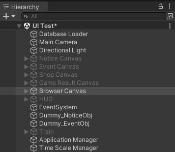
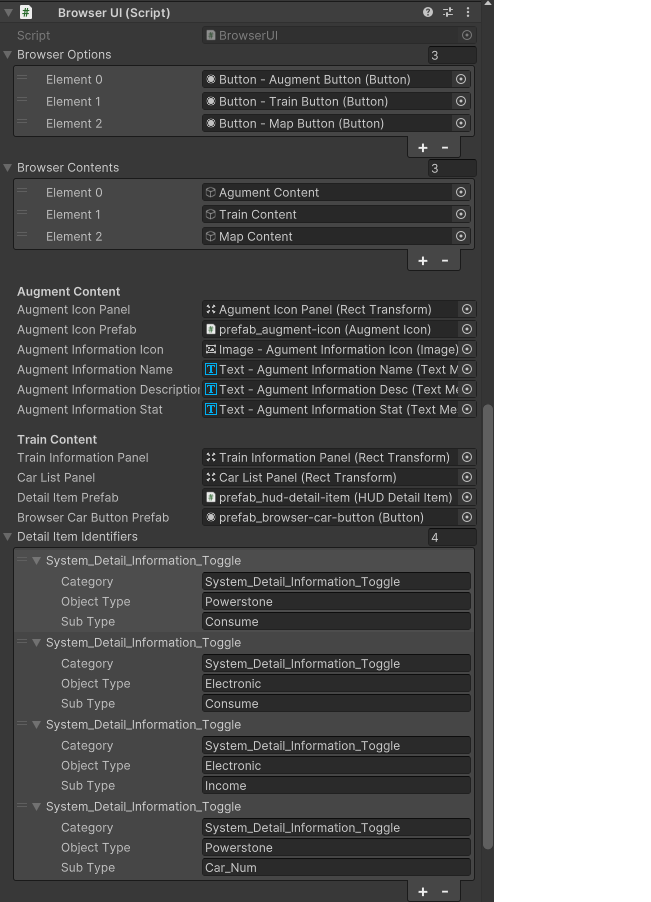

## 구현 설명
* [BrowserUI.cs부분](./implement/BrowserUI.md)
## 현재 구현된 것을 보는법
* Assets > Scences > Develop Scence > UI Test
	+ 하이라이키 창 Browser Canvas 오브젝트 활성화, 나머지 비활성화
	 + 
## 참고 기획 문서
* https://docs.google.com/presentation/d/15FUgGttBdiSQS256ion7H-yEUF1DhyVLN8_fhP9zZG8/edit#slide=id.g2713a008554_2_712
## 브라우저 인스펙터
* *https://docs.google.com/spreadsheets/d/1ggNM4tM3_zZigdZPan29CJD9NnmLdk3iAKksM9TLXM4/edit#gid=2070682695 - Index 부분 참고*
* **Browser Options, Browser Contents**
	+ Browser Options
		+ 증강체, 열차, 맵 정보 버튼들
	+ Browser Contnents
		+ 증강체, 열차, 맵 정보 오브젝트들
* **Detail Item Identifiers**
	+ 세부 정보에 Text만 받아오기 위함, Identifier만 바꿔주기
		+ Category - System_Detail_Information_Toggle
		+ Object Type - *(스프레드 시트 Index 참조)*
		+ Sub Type - *(스프레드 시트 Index 참조)*
* 딱히 추가해야 할 것은 없으나 Index부분이 바뀌면 Identifier 수정 필요
	+ 
## 참고
* Scene
	+ Assets > Scenes > Develop Scene > UI Test > Browser Canvas
## 추후 수정 사항
* **BrowserUI.cs**
	+ 증강체 데이터 가져와서 증강체 아이콘 생성 (identifier, 증강체 갯수)
	+ 증강체 아이콘 선택 이펙트 추가
	+ 증강체 아이콘 이미지 변경
	+ 스텟 데이터 가져와서 텍스트 변경 (augmentInformationStat)
	+ 열차 정보 데이터 가져오기 (detailItem.DetailValue)
	+ 차량 정보 데이터 가져오기 (identifier, stat, model, 차량 갯수)
	+ 맵 구현하기
## 최종 수정 일자 24.06.07 12:41