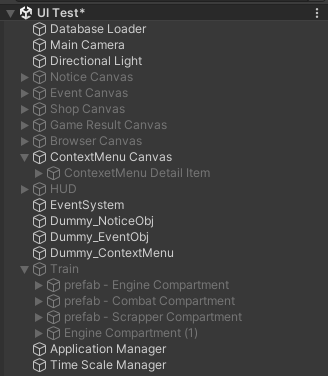
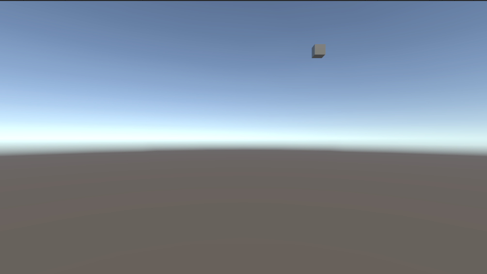
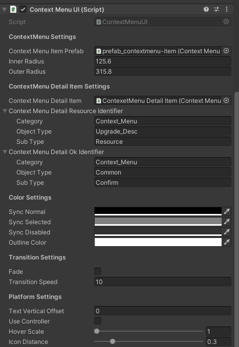

## 구현 설명
* [ContextMenuUI.cs부분](ContextMenuUI.md)
## 현재 구현된 것을 보는법
* Assets > Scences > Develop Scence > UI Test
	+ 하이라이키 창 ContextMenu Canvas 오브젝트 활성화,  Dummy_ConextMenu 오브젝트 활성화 나머지 비활성화
	 + 
	 + 
	 + 큐브(Dummy_ContextMenu) 클릭시 생성, 큐브의 위치를 바꾸고 클릭하면 그 위치에서 생성
## 참고 기획 문서
* https://docs.google.com/presentation/d/15FUgGttBdiSQS256ion7H-yEUF1DhyVLN8_fhP9zZG8/edit#slide=id.g2713a008554_0_1
## 컨텍스트 메뉴 인스펙터
* *https://docs.google.com/spreadsheets/d/1ggNM4tM3_zZigdZPan29CJD9NnmLdk3iAKksM9TLXM4/edit#gid=2070682695 - Index 부분 참고*
* 해당 스크립트를 가진 오브젝트 클릭 시 씬 뷰에서 크기 확인 가능(파랑 - 내부 반경, 빨강 - 외부 반경)
* 
* **ContextMenu Settings**
	+ Inner Radius
		+ 내부 반경
	+ Outer Radius
		+ 외부 반경
* **ContextMenu Detail Item Settings**
	+ Context Menu Detail Resource Identifier
		+ Index "소모" 부분 텍스트 정보 받아오기
	+ Context Menu Detail Ok Identifier
		+ Index "확인" 부분 텍스트 정보 받아오기
* **Color Settings**
	+ Sync Normal
		+ 선택하지 않았을 때의 색 지정
	+ Sync Selected
		+ 선택 되었을 때(마우스 호버)때의 색 지정
	+ Sync Disabled
		+ 선택할 수 없을 때의 색 지정
	+ Outline Color
		+ 메뉴 경계선 색 지정
* **Transition Settings**
	+ Fade
		+ 색이 옅어진 채로 생성
	+ Transition Speed
		+ 컨텍스트 메뉴가 생성, 삭제 되는 시간
* **Platform Setting**
	+ Text Vertical Offset
		+ 텍스트 위치 조정
	+ Use Controller
		+ 컨트롤러 사용 체크
	+ Hover Scale
		+ 선택 되었을 때(마우스 호버)의 크기 지정
	+ Icon Distance
		+ 아이콘 위치 조정
## 참고
* 오브젝트
	+ UI Test Scene > Dummy_ContextMenu
* Scene
	+ Assets > Scenes > Develop Scene > UI Test > ContextMenu Canvas
## 추후 수정 사항
* **ContextMenuUI.cs**
	+ 차량에서 생성되게 변경
	+ 컨텍스트 메뉴 세부 정보 차량 데이터(identifier) 받아와서 적용하기(DetailName, DetailDescrition)
	+ 컨텍스트 메뉴 데이터(자원 소모 정보 등) 받아와서 적용하기(contextDetailResource 생성, contextDetailItem.Icon, Amount)
* **ContextMenuDetailItem.cs**
	+ 컨텍스트 메뉴 세부 정보 자원 패널 지정(ContextMenu Detail Resource Panel)
* **Car.cs**
	+ IContextMenuDataProvider 상속 받아서 인터페이스 함수 구현, UnitIdentifier 데이터 받아오기
	+ ContextMenuData TextIdentfieir -> UnitIdentifier로 변경
	+ 
	
## 최종 수정 일자 24.06.12 16:51