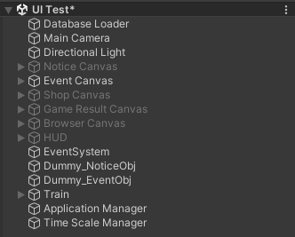
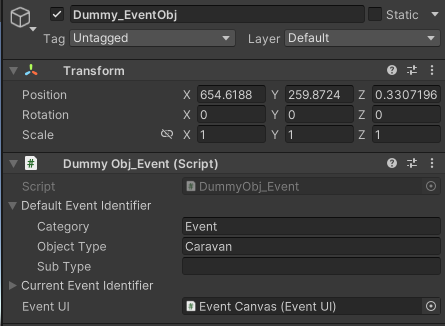

## 구현 설명
* [EventUI.cs 부분](./implement/EventUI.md)
## 현재 구현된 것을 보는 법
* Assets > Scences > Develop Scence > UI Test
	+ 하이라이키 창 Event Canvas 오브젝트 활성화, 나머지 비활성화
	+ 
	+ 하이라이키 창 Dummy_EventObj 오브젝트 인스펙터 변경
	+ Default Event Identifier를 변경하고 중앙에 Button 클릭
	+ 
	+ 게임 실행 중에도 변경 후 중앙에 Button을 누르면 해당 이벤트로 세팅
## 상호작용 오브젝트 인스펙터 (이벤트 노드)
* *https://docs.google.com/spreadsheets/d/1ggNM4tM3_zZigdZPan29CJD9NnmLdk3iAKksM9TLXM4/edit#gid=76848005 - Index 부분 참고*
* **Default Event Identifier** : 이벤트 Index 부분 나눠서 입력
	+ Category - Event
	+ Object Type - Category 다음 부분
	+ Sub Type - Object Type 다음 부분 전부
	+ Sub Type은 비워도 상관없음
	+ 예시) Event_Wreck
		+ Category - Event
		+ Object Type - Wreck
		+ Sub Type - 
	+ 예시) Event_Wreck_Attack_Warning
		+ Cagtegory - Event
		+ Object Type - Wreck
		+ Sub Type - Attak_Warning

## 참고
* 오브젝트
	+ UI Test Scene > Dummy_EventObj
* Scene
	+ Assets > Scenes > Develop Scene > UI Test > Event Canvas
* 더미 파일
	+ Assets > Scripts > UI > Event > DummyObj_Event.cs
* 더미 사용법
	+ Assets > Scenes > Develop Scene > UI Test > Event Canvas를 활성화
	+ UI Test Scene > Dummy_EventObj의 Default Notice Identifier를 변경하고 중앙에 Button 클릭
	+ 이벤트 종료후에도 해당 행동 반복 가능
## 추후 수정 사항
* **EventUI.cs**
	+ 이벤트 노드의 Identifier 자체를 변경? (현재는 m_EventDataProvider를 바꿈)
	+ EventImage 이미지 변경
	+ 인덱스 1번일 때 무조건 닫기 변경 (무시 선택지 다음에도 이벤트가 있는 경우)
	+ 상점 리스트 데이터 받아오기
	+ 이벤트 함수 각각 구현
	+ 공격 이벤트 함수 구현
	+ 확률 데이터 받아오기
## 최종 수정 일자 24.06.05 17:58