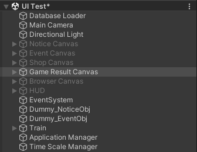
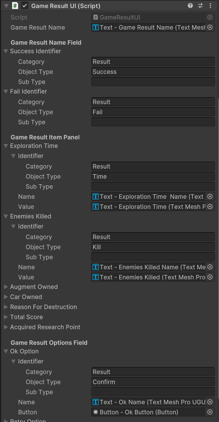

## 구현 설명
* [GameResult.cs 부분](./implement/GameResultUI)
## 현재 구현된 것을 보는 법
* Assets > Scences > Develop Scence > UI Test
	+ 하이라이키 창 Game Result Canvas 오브젝트 활성화, 나머지 비활성화
	+ 
## 게임 결과창 인스펙터
* *https://docs.google.com/spreadsheets/d/1ggNM4tM3_zZigdZPan29CJD9NnmLdk3iAKksM9TLXM4/edit#gid=2070682695 - Index 부분 참고*
* **Game Result Name Field**
	+ Success Identifier - 성공 Index 나눠서 입력
		+ Category - Result
		+ Object Type - Success
		+ Sub Type - 빈칸
	+ Fail Identifier - 실패 Index 나눠서 입력
		+ Category - Result
		+ Object Type = Success
		+ Sub type - 빈칸
* **Game Result Item Panel**
	+ 각각 Identifier만 바꿔주기
		+ Category - Result
		+ Object Type - Result 다음 부분 *(스프레드 시트 Index 참조)*
		+ Sub Type - 빈칸(Num,Text 부분은 현재 쓰지 않음)
* **Game Result Options Field**
	+ 각각 Identifier만 바꿔주기
		+ Category - Result
		+ Object Type - Result 다음 부분 *(스프레드 시트 Index 참조)*
		+ Sub Type - 빈칸
* 딱히 추가해야 할 것은 없으나 Index부분이 바뀌면 Identifier 수정 필요
	+ 
## 참고
* Scene
	+ Assets > Scenes > Develop Scene > UI Test > Game Result Canvas
## 추후 수정 사항
* **GameResultUI.cs**
	+ 게임 결과 데이터 가져와서 값 선언 (GameResultItem.value)
	+ CloseCallback 추가 필요
	+ 게임 결과 데이터를 어떻게 정하느냐에 따라서 GameResultItem 리스트화
## 최종 수정 일자 24.06.05 16:14