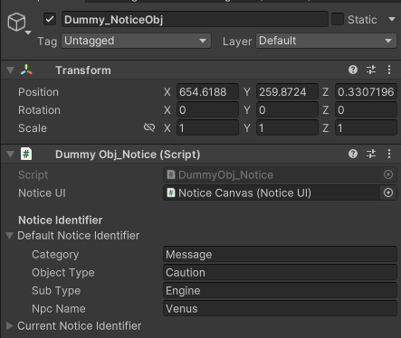

## 구현 설명
* [NoticeUI.cs부분](./implement/NoticeUI.md)
## 현재 구현된 것을 보는 법
* Assets > Scences > Develop Scence > UI Test
	+ 하이라이키 창 Notice Canvas 오브젝트 활성화, 나머지 비활성화
	+ 
	+ __공용__
		+ 하이라이키 창 Dummy_NoticeObj 오브젝트 인스펙터 변경
		+ Default Notice Identifier를 변경
		+ 
	+ __주의/경고 메시지 생성__
		+ Notice(Warning) 버튼 클릭
	+ __주의/경고 메시지 삭제__
		+ SolveWarning 버튼 클릭
		+ 단, Default Notice Identifier에 있는 것을 기준으로 삭제함
		+ 예시) Dummy_NoticeObj에 Message_Caution_Engine 이 입력되어 있는 상태
			+ 생성 후 다른 주의 메세지를 생성하기 위해서 Dummy_NoticeObj에 Message_Caution_Environment_AcidRain를 입력하고 생성함
			+ SolveWarning 버튼을 누르면 Message_Caution_Environment_AcidRain의 주의 메시지가 삭제됨
	+ __알림 메시지__
		+ Dummy_NoticeObj의 Npc Name을 입력해야함
		+ Notice 버튼 클릭
## 참고 기획 문서
* 
## 메시지 오브젝트 인스펙터
* *https://docs.google.com/spreadsheets/d/1ggNM4tM3_zZigdZPan29CJD9NnmLdk3iAKksM9TLXM4/edit#gid=2070682695 - Index 부분 참조*
* **Default Notice Identifier** : 알림/경고/주의 메시지 Index 부분 나눠서 입력
	+ __공용__
		+ Category - Message
		+ Object Type - Notice/Warning/Caution
		+ Sub Type - Index 끝부분
		+ 예시) Message_Warning_Damage_Reload
			+ Category - Message
			+ Object Type - Warning
			+ Sub Type - Damage_Reload
	+ __알림 메시지__
		+ 공용 부분 작성 후, Npc Name 작성
		+ Npc Name은 스프레드 시트 참조 (Message_Name_NpcName)
	+ __경고 메시지__
		+ 공용 부분 작성 후, Npc Name 비워도 상관없음
## 참고
* 오브젝트
	+ UI Test Scene > Dummy_NoticeObj
* Scene
	+ Assets > Scenes > Develop Scene > UI Test > Notice Canvas
	+ 주의/경고 버튼
		+ NoticeWarningButton
	+ 해결 버튼
		+ NoticeWarningDeleteButton
	+ 알림 버튼
		+ NoticeButton
* 더미 파일
	+ Assets > Scripts > UI > Notice > DummyObj_Notice.cs
## 추후 수정 사항
* **NoticeUI.cs**
	+ 알림, 경고, 주의 데이터 받아오기 (identifier)
	+ 알림, 경고, 주의 이미지 변경
	+ 알림, 경고, 주의 함수 통합 (가능하면)
## 최종 수정 일자 24.06.05 18:46