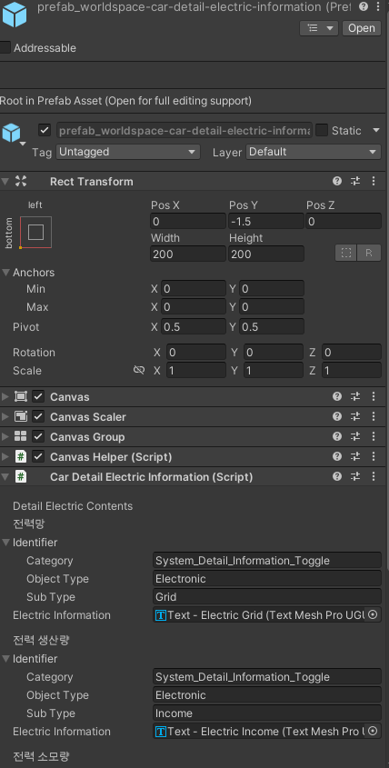

## 구현설명
* [[HUD]]
* [[Car]]
## HUD 인게임 인스펙터
* **Detail Layers**
	+ https://docs.google.com/spreadsheets/d/1ggNM4tM3_zZigdZPan29CJD9NnmLdk3iAKksM9TLXM4/edit#gid=2070682695 - Index 부분 참고
	+ 기본적으로 입력되어 있는 필드
		+ Default Layer
			+ 동력석 소비 총량
		+ Electric Power Layer
			+ 전력 소비량
			+ 전력 생산량
			+ 전력망 수
			+ 연결되지 않은 차량
		+ Power Stone Layer
			+ 동력석 (초당) 총 소비량
			+ 차량 수
			+ 동력석 소모 잔여시간
	+ https://docs.google.com/presentation/d/15FUgGttBdiSQS256ion7H-yEUF1DhyVLN8_fhP9zZG8/edit#slide=id.g2713a008554_2_1125 - 인 게임 - 세부 정보 토글 참조
	+ 딱히 추가해야 할 것은 없으나 Index부분이 바뀌면 Identifier 수정 필요
	+ 
## Electric-Information 인스펙터
* 프리팹 이름 : prefab_worldspace-car-detail-electirc-information
* **Detail Electric Contents**
	+ 기본적으로 입력되어 있는 필드
		+ 전력망
		+ 전력 생산량
		+ 전력 소모량
		+ 잔여 전력
	* 딱히 추가해야 할 것은 없으나 Index 부분이 바뀌면 Identifier 수정 필요
	* 