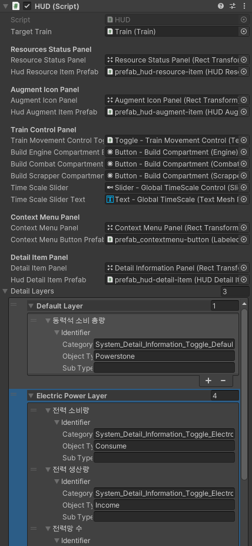

## 구현설명
* [HUD.cs 부분](./implement/HUD.md)
* [Car.cs 부분](./implement/Car.md)
## 참고 기획 문서
* *https://docs.google.com/presentation/d/15FUgGttBdiSQS256ion7H-yEUF1DhyVLN8_fhP9zZG8/edit#slide=id.g2713a008554_2_1125*
## 현재 구현된 것을 보는 법
* Assets > Scences > Develop Scence > UI Test
	+ 하이라이키 창 HUD 오브젝트 활성화, 나머지 비활성화
	 + 
## HUD 인게임 인스펙터
+ 위치 : HUD 오브젝트
* **Detail Layers**
	+ *https://docs.google.com/spreadsheets/d/1ggNM4tM3_zZigdZPan29CJD9NnmLdk3iAKksM9TLXM4/edit#gid=2070682695 - Index 부분 참고*
	+ 기본적으로 입력되어 있는 필드
		+ Default Layer
			+ 동력석 소비 총량
		+ Electric Power Layer
			+ 전력 소비량
			+ 전력 생산량
			+ 전력망 수
			+ 연결되지 않은 차량
		+ Power Stone Layer
			+ 동력석 (초당) 총 소비량
			+ 차량 수
			+ 동력석 소모 잔여시간
	+ *https://docs.google.com/presentation/d/15FUgGttBdiSQS256ion7H-yEUF1DhyVLN8_fhP9zZG8/edit#slide=id.g2713a008554_2_1125 - 인 게임 - 세부 정보 토글 참조*
	+ 딱히 추가해야 할 것은 없으나 Index부분이 바뀌면 Identifier 수정 필요
	 + 
## Electric-Information 인스펙터
* 프리팹 이름 : prefab_worldspace-car-detail-electirc-information
* **Detail Electric Contents**
	+ 기본적으로 입력되어 있는 필드
		+ 전력망
		+ 전력 생산량
		+ 전력 소모량
		+ 잔여 전력
	* 딱히 추가해야 할 것은 없으나 Index 부분이 바뀌면 Identifier 수정 필요
	 + 
## 추후 수정 사항
* **HUD.cs**
	+ Detail 데이터(전력 소비량, 전력 생산량, 전력망 수, 연결되지 않은 차량 등) 가져와서 HUDDetailItem.DetailValue 텍스트에 할당
	+ Resouce 이미지 변경 (HUDResourceItem.ResourceImage)
	+ Augment 이미지 변경 (HUDAugmentItem.AugmentIconImage)
	+ Augment 데이터 (identifier) 받아와서 HUDAugmentItem.AugmentName, HUDAugmentItem.AugmentDescripiton 텍스트에 할당
	+ Train.cs에서 delegate event 추가 필요 (OnAugmentChangedCallback) > UpdateAugmentIconPanel 구독하기
	+ 보유한 Augment 수 만큼 AugmentItem 생성
* **Car.cs**
	+ CarDetailStatEffectIcon (전력 과부화 / 부품 파손 등) 이미지 변경
	+ 차량 전력 데이터(전력망, 전력 생산량, 전력 소모량, 잔여 전력)의 값을 가져와서 DetailElectricContent.electricInformation 텍스트에 할당
	+ 차량 동력석 데이터(초당 동력석 소비량) 가져와서 CarDetailPowerStone.PowerStoneAmount 텍스트에 할당
	+ CerDetailElectircIcon.ElectricAmount 값 변경 (생산량 - 소모량 인듯)
	+ CerDetailElectircIcon.ElectricIconColor 색깔 변경
## 최종 수정 일자 24.06.05 17:32